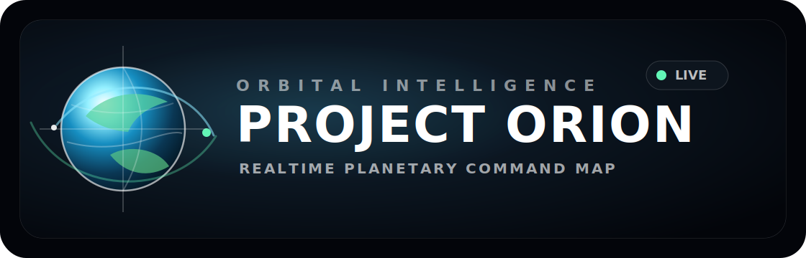

<p align="center">
  
</p>

# Project Orion

Project Orion is a realtime planetary intelligence and Earth visualization platform built on CesiumJS. It combines cinematic satellite imagery, live weather maps, orbital tracking, aircraft and vessel intelligence, CameraNet, environmental monitoring, infrastructure overlays, tactical scan modes, saved locations, and historical timeline playback in a dark glass command interface.

## About

Orion is designed as an operational globe rather than a static map. The application layers public Earth imagery, weather intelligence, live telemetry, and selectable entities into one reusable rendering system. It supports local backend mode for the richest live data and static GitHub Pages mode for the public visualization experience.

## Current Capabilities

- Cesium globe with NASA GIBS satellite imagery and cloud-free Earth mode.
- Zoom Earth-style weather map modes for radar, precipitation, wind, temperature, humidity, and pressure.
- Smooth timeline playback with hourly and received-update stepping.
- Live satellite and constellation layers using CelesTrak TLE data.
- Aircraft, vessel, camera, weather, wildfire, earthquake, lightning, cyber, cable, airspace, power, and RF layer systems.
- Selectable telemetry list with camera locking, free orbit, and unlock controls.
- CameraNet architecture with provider adapters, clustering, and on-demand stream or snapshot loading.
- Saved locations stored in the browser.
- GitHub Pages static mode for direct public imagery where browser CORS allows it.
- Local Python server mode for proxying tiles, CameraNet, and backend-only feeds.

## Run Locally

Use the included launcher:

```powershell
powershell -ExecutionPolicy Bypass -File .\start-orion.ps1
```

Then open the URL printed by the launcher. The default is:

```text
http://127.0.0.1:4174/
```

If that port is busy, the launcher selects another local port.

## GitHub Pages

The hosted site runs at:

```text
https://arxhsz.github.io/Project-Orion/
```

The frontend is static-compatible. When hosted from GitHub Pages, Orion automatically switches NASA GIBS imagery roots from the local `/gibs` proxy to the public NASA tile service.

The GitHub Pages workflow builds same-origin static JSON snapshots for public data feeds so the hosted build can run satellites, aircraft, cameras, earthquakes, radar, weather maps, wildfires, and intel overlays without a local Python server. Local server mode remains available for live proxying, CameraNet stream resolution, and provider workflows that require same-origin request handling.

## Repository Layout

```text
index.html                  Main application shell
app.js                      Cesium app, timeline, layers, interaction logic
styles.css                  Orion tactical interface styling
orion-config.js             Layer definitions and runtime constants
orion_server.py             Local API and tile proxy server
camera_providers.py         CameraNet provider adapters
cameranet_frontend.js       CameraNet clustering and feed UI
orion-renderer-*.js         Modular renderers for imagery, primitives, environment, and infrastructure
assets/orion-logo.svg       Repository logo
```

## Validation

Before publishing, run:

```powershell
python -m py_compile orion_server.py camera_providers.py intel_layers_expanded.py
node --check app.js
node --check orion-config.js
node --check cameranet_frontend.js
node --check orion-renderer-environment.js
node --check orion-renderer-primitive.js
node --check orion-renderer-imagery.js
node --check orion-renderer-infrastructure.js
```

## Notes

Some realtime data providers limit browser access, require tokens, or block cross-origin requests. Orion keeps those integrations behind provider adapters so the frontend can stay stable while local or hosted backend proxies handle provider-specific access rules.
